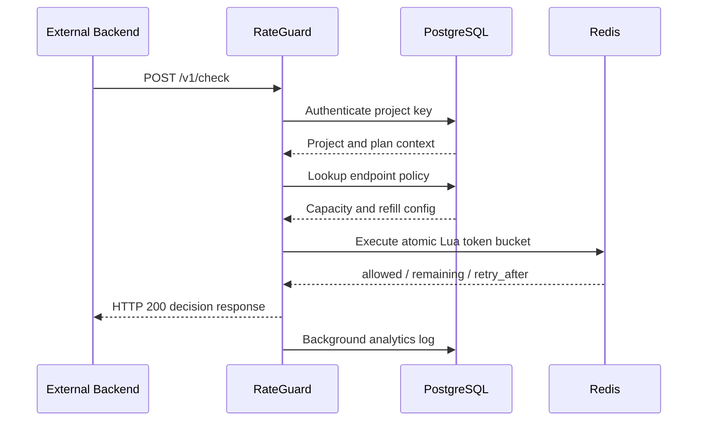

# RateGuard

RateGuard is a multi-tenant, hosted **server-to-server rate-limiting decision service**.

Developers can register, create projects, generate secret integration keys, configure custom per-endpoint rate-limit policies, and call a centralized `POST /v1/check` API before executing protected operations.

The critical decision path uses **Redis + an atomic Lua token-bucket algorithm**, while **PostgreSQL** stores users, projects, keys, policies, request logs, and analytics.

---

## Live Deployment

### Backend

`https://rateguard-backend-production.up.railway.app`

### Health Endpoints

- `https://rateguard-backend-production.up.railway.app/health/live`
- `https://rateguard-backend-production.up.railway.app/health/ready`

### Frontend

`<YOUR_VERCEL_FRONTEND_URL>`

Replace the frontend placeholder with the final deployed Vercel URL.

---

## What Problem Does RateGuard Solve?

Applications often need limits such as:

- 5 AI resume generations per minute
- 10 OTP requests per minute
- 100 API calls per hour
- 50 search requests per second

Without a centralized service, each application must independently implement:

- rate-limit algorithms
- Redis state management
- concurrency control
- per-user bucket isolation
- policy configuration
- analytics
- observability

RateGuard centralizes that responsibility behind a simple decision API.

An external backend sends:

```http
POST /v1/check
Authorization: Bearer rg_project_...
Content-Type: application/json
```

```json
{
  "subject": "user:42",
  "route": "/generate-resume",
  "method": "POST"
}
```

RateGuard returns a decision:

```json
{
  "allowed": true,
  "remaining": 4,
  "limit": 5
}
```

The integrating backend then decides whether to continue the protected operation.

---

## Core Features

### Authentication and Multi-Tenancy

- Developer registration and login
- Argon2 password hashing
- JWT-based authentication
- HttpOnly session cookies
- Project ownership isolation
- Tenant-scoped project access
- Owner-scoped analytics and configuration

### Project Integration

- Project-specific secret integration keys
- Raw key displayed only once
- SHA-256 hashed key storage
- Key revocation
- Project-scoped authentication

### Rate-Limit Policies

- Per-project policies
- Per-endpoint policies
- Per-HTTP-method policies
- Configurable capacity
- Configurable refill amount
- Configurable refill unit
- Policy activation/deactivation

### Rate-Limit Engine

- Token Bucket algorithm
- Redis-backed live bucket state
- Atomic Lua execution
- Per-project isolation
- Per-policy isolation
- Per-subject isolation
- TTL-based bucket cleanup
- `allowed`, `remaining`, `retry_after`, and reset metadata

### Privacy and Security

- Raw integration keys are never stored
- Raw external subjects are never stored
- Project-scoped HMAC-SHA256 subject pseudonymization
- Environment-driven CORS
- Configurable trusted hosts
- Server-only internal admin secret
- Optional production metrics endpoint

### Analytics

- Total checks
- Allowed decisions
- Blocked decisions
- Block rate
- Unique subjects
- Average latency
- Active endpoints
- Per-endpoint analytics
- Background request logging

### Observability

- Prometheus metrics
- Grafana operational dashboard
- Request throughput
- p95 latency
- HTTP 5xx rate
- Allowed vs blocked decision rate
- Failures grouped by reason
- Backend health monitoring

### Performance Testing

- k6 staged load testing
- Ramp-up to concurrent virtual users
- Same-subject burst testing
- Atomic Redis bucket validation
- Threshold-based performance checks

### Production Readiness

- Alembic migrations
- Idempotent production seed
- Liveness endpoint
- Readiness endpoint
- Railway deployment
- Railway PostgreSQL
- Railway Redis
- Vercel-ready Next.js frontend

---

## Architecture

```mermaid
flowchart LR
    Dev[Developer] --> UI[Next.js Dashboard]

    UI --> BFF[Next.js Server Routes]
    BFF --> API[FastAPI Backend]

    App[External Project Backend]
        -->|POST /v1/check| API

    API --> PG[(PostgreSQL)]
    API --> Redis[(Redis)]

    API -->|Atomic Lua Token Bucket| Redis
    API -. Background Analytics Logging .-> PG

    API --> Metrics[/metrics]
    Metrics --> Prom[Prometheus]
    Prom --> Grafana[Grafana]

    K6[k6] -->|Concurrent Load| API
```

---

## `/v1/check` Request Flow



---

## Technology Stack

### Frontend

- Next.js
- TypeScript
- Tailwind CSS
- Lucide React

### Backend

- Python
- FastAPI
- SQLAlchemy
- Psycopg 3
- Alembic

### Data Layer

- PostgreSQL
- Redis

### Observability

- Prometheus
- Grafana

### Performance Testing

- k6

### Infrastructure and Deployment

- Docker Compose
- Railway
- Vercel

---

## Rate-Limiting Algorithm

RateGuard uses the **Token Bucket** algorithm.

Each bucket stores:

- current token count
- last refill timestamp

For a policy such as:

```text
Capacity = 5
Refill = 1 token/minute
```

a subject can consume up to five immediately available tokens.

Tokens refill over time:

```text
new_tokens = elapsed_time × refill_rate
```

The bucket is capped at the configured capacity.

---

## Why Redis Lua?

A naive implementation could use:

```text
GET bucket
↓
calculate new token count
↓
SET bucket
```

Under concurrency, multiple requests may read the same state and incorrectly allow more requests than intended.

RateGuard executes the complete state transition in one Redis Lua script:

```text
Read state
↓
Refill tokens
↓
Check available capacity
↓
Consume token if allowed
↓
Persist updated state
```

Because the script runs atomically in Redis, concurrent requests targeting the same bucket do not create a read-modify-write race.

---

## Bucket Isolation

The Redis bucket key is conceptually:

```text
project
+
policy
+
pseudonymized subject
```

Example:

```text
rate_limit:
project:12:
policy:7:
subject:<hmac>
```

This isolates:

- different projects
- different endpoint policies
- different subjects

---

## Subject Privacy

RateGuard does not persist raw external user identifiers.

Instead of storing:

```text
user:42
```

it computes a project-scoped HMAC-SHA256 value:

```text
HMAC(
  SUBJECT_HASH_SECRET,
  project_id + subject
)
```

This gives RateGuard a stable pseudonymous identifier for analytics and bucket isolation without storing the raw subject.

---

## API

### Check Rate Limit

```http
POST /v1/check
```

### Headers

```http
Authorization: Bearer rg_project_...
Content-Type: application/json
```

### Request Body

```json
{
  "subject": "user:42",
  "route": "/generate-resume",
  "method": "POST"
}
```

### Allowed Decision

```json
{
  "allowed": true,
  "remaining": 4
}
```

### Blocked Decision

```json
{
  "allowed": false,
  "remaining": 0,
  "retry_after_seconds": 42
}
```

A blocked decision still returns HTTP `200` because RateGuard successfully produced a decision.

The integrating application should return HTTP `429 Too Many Requests` to its own end user when:

```json
{
  "allowed": false
}
```

---

## Integration Example

```python
import requests

response = requests.post(
    "https://rateguard-backend-production.up.railway.app/v1/check",
    headers={
        "Authorization": "Bearer rg_project_your_key"
    },
    json={
        "subject": "user:42",
        "route": "/generate-resume",
        "method": "POST",
    },
    timeout=5,
)

response.raise_for_status()

decision = response.json()

if not decision["allowed"]:
    raise Exception("Rate limit exceeded")

# Continue protected operation
```

---

## Example Application Flow

```text
End User
   |
   v
Project X Backend
   |
   | POST /v1/check
   | Bearer rg_project_...
   | subject=user:42
   v
RateGuard
   |
   +-- Authenticate project key
   +-- Find route/method policy
   +-- Run Redis Lua token bucket
   |
   v
allowed=true/false
   |
   v
Project X Backend
   |
   +-- allowed=true  -> continue operation
   +-- allowed=false -> return 429
```

End users never receive the RateGuard integration key.

---

## Analytics

RateGuard provides developer-facing analytics including:

- total checks
- allowed decisions
- blocked decisions
- block rate
- unique subjects
- average latency
- active endpoints
- endpoint-level traffic

Analytics are scoped to the authenticated project owner.

---

## Observability

The FastAPI backend exposes Prometheus metrics such as:

```text
rateguard_http_requests_total
rateguard_http_request_duration_seconds
rateguard_check_decisions_total
rateguard_check_duration_seconds
rateguard_check_failures_total
```

Grafana visualizes:

- backend health
- request rate
- p95 check latency
- HTTP 5xx rate
- traffic by route
- allowed vs blocked decisions
- p95 latency by route
- failures by reason

Prometheus/Grafana monitoring is separate from customer-facing PostgreSQL analytics.

---

## Load Testing

RateGuard includes two k6 tests.

### 1. Staged Load Test

Traffic ramps through multiple virtual-user levels:

```text
10 VUs
↓
25 VUs
↓
50 VUs
↓
Ramp down
```

The test measures:

- HTTP failure rate
- request latency
- p95 latency
- valid decision rate
- allowed decisions
- blocked decisions

### 2. Concurrent Same-Subject Burst Test

Multiple virtual users target the exact same subject concurrently.

This validates that all requests compete for the same Redis bucket and that the Lua state transition remains atomic.

Run the staged test:

```powershell
docker run --rm -i `
    -v "${PWD}/load-tests:/scripts" `
    -e BASE_URL="http://host.docker.internal:8000" `
    -e RATEGUARD_API_KEY="$PROJECT_KEY" `
    grafana/k6 `
    run /scripts/rateguard-load.js
```

Run the burst test:

```powershell
docker run --rm -i `
    -v "${PWD}/load-tests:/scripts" `
    -e BASE_URL="http://host.docker.internal:8000" `
    -e RATEGUARD_API_KEY="$PROJECT_KEY" `
    grafana/k6 `
    run /scripts/rateguard-burst.js
```

No benchmark numbers are claimed here because results depend on the machine, database, Redis deployment, network, and test configuration.

---

## Health Endpoints

### Liveness

```http
GET /health/live
```

Checks whether the application process is alive.

Example response:

```json
{
  "status": "alive"
}
```

### Readiness

```http
GET /health/ready
```

Checks whether RateGuard can use both PostgreSQL and Redis.

Example response:

```json
{
  "status": "ready",
  "checks": {
    "postgres": true,
    "redis": true
  }
}
```

A failed dependency check returns HTTP `503`.

---

## Local Development

### Prerequisites

Install:

- Python
- Node.js
- Docker Desktop
- Git

---

### 1. Clone the Repository

```bash
git clone https://github.com/Sankalp-Sinha/api-rate-limiter.git
cd api-rate-limiter
```

---

### 2. Start Local Infrastructure

```bash
docker compose up -d
```

This starts the configured local infrastructure, including PostgreSQL, Redis, Prometheus, and Grafana.

---

### 3. Backend Setup

```bash
cd backend
python -m venv .venv
```

Windows:

```powershell
.\.venv\Scripts\activate
```

Install dependencies:

```bash
pip install -r requirements.txt
```

Create:

```text
backend/.env
```

using:

```text
backend/.env.example
```

as the template.

Run migrations:

```bash
alembic upgrade head
```

Start FastAPI:

```bash
uvicorn app.main:app --reload --host 0.0.0.0 --port 8000
```

Backend:

```text
http://localhost:8000
```

---

### 4. Frontend Setup

```bash
cd frontend
npm install
```

Create:

```text
frontend/.env.local
```

using:

```text
frontend/.env.example
```

as the template.

Start:

```bash
npm run dev
```

Frontend:

```text
http://localhost:3000
```

---

### 5. Demo Project X

```bash
cd demo-project-x
python -m venv .venv
```

Windows:

```powershell
.\.venv\Scripts\activate
```

Install:

```bash
pip install -r requirements.txt
```

Create:

```text
demo-project-x/.env
```

using:

```text
demo-project-x/.env.example
```

Start:

```bash
uvicorn app.main:app --reload --port 9000
```

---

## Environment Variables

### Backend

See:

```text
backend/.env.example
```

Important variables:

```text
DATABASE_URL
REDIS_URL
ADMIN_API_KEY
JWT_SECRET_KEY
JWT_ALGORITHM
JWT_ACCESS_TOKEN_EXPIRE_MINUTES
SUBJECT_HASH_SECRET
CORS_ORIGINS
ALLOWED_HOSTS
ENABLE_METRICS
```

---

### Frontend

See:

```text
frontend/.env.example
```

Required:

```text
FASTAPI_BASE_URL
ADMIN_API_KEY
```

`ADMIN_API_KEY` is server-only and must not use the `NEXT_PUBLIC_` prefix.

---

### Demo Project X

See:

```text
demo-project-x/.env.example
```

Required:

```text
RATEGUARD_BASE_URL
RATEGUARD_API_KEY
```

---

## Security Design

- Passwords hashed with Argon2
- JWT developer authentication
- HttpOnly session cookies
- Multi-tenant ownership checks
- Project-scoped authorization
- Integration keys stored only as hashes
- Raw integration keys shown once
- Constant-time internal secret comparison
- Raw external subjects are not stored
- HMAC-SHA256 subject pseudonymization
- Environment-driven CORS
- Configurable trusted hosts
- Metrics endpoint can be disabled in production

---

## Database Migrations

RateGuard uses Alembic.

Apply all migrations:

```bash
alembic upgrade head
```

The production deployment also runs an idempotent seed that ensures the required default plan exists without creating legacy demo API keys.

---

## Deployment

### Backend

Railway

Start command:

```bash
uvicorn app.main:app --host 0.0.0.0 --port $PORT
```

Pre-deploy command:

```bash
alembic upgrade head && python -m scripts.seed_production
```

Healthcheck path:

```text
/health/ready
```

---

### PostgreSQL

Railway PostgreSQL

The backend consumes:

```text
DATABASE_URL
```

---

### Redis

Railway Redis

The backend consumes:

```text
REDIS_URL
```

---

### Frontend

Vercel

The frontend service requires:

```text
FASTAPI_BASE_URL
ADMIN_API_KEY
```

---

## Project Structure

```text
api-rate-limiter/
├── backend/
│   ├── alembic/
│   ├── app/
│   │   ├── dependencies/
│   │   ├── middleware/
│   │   ├── models/
│   │   ├── monitoring/
│   │   ├── routers/
│   │   ├── schemas/
│   │   └── services/
│   └── scripts/
│
├── frontend/
│
├── demo-project-x/
│
├── load-tests/
│
├── monitoring/
│   ├── prometheus.yml
│   └── grafana/
│
├── docker-compose.yml
└── README.md
```

---

## Key Engineering Decisions

### Why Redis?

Rate-limit state is latency-sensitive and updated on almost every request. Redis provides low-latency access and atomic script execution.

### Why PostgreSQL?

Users, projects, ownership, keys, policies, and analytics need durable relational persistence.

### Why `/v1/check` Instead of Application Middleware?

A hosted decision API allows multiple independent applications to use the same centralized rate-limiting platform without embedding RateGuard-specific middleware into every application.

### Why HTTP 200 for Blocked Decisions?

`allowed=false` is a valid successful decision from RateGuard. The caller decides whether to return HTTP `429` to its own end user.

### Why Use a Subject Instead of Only an IP Address?

RateGuard is server-to-server. The integrating application chooses its logical identity:

- user ID
- organization ID
- API client
- IP address
- device ID
- another opaque identifier

### Why Prometheus and Grafana?

Customer analytics and infrastructure monitoring solve different problems.

- PostgreSQL powers tenant-facing analytics.
- Prometheus and Grafana monitor operational health and performance.

### Why Background Analytics Logging?

The rate-limit decision is the critical path. Request-log persistence is useful but non-critical, so logging is scheduled after the decision response instead of forcing every caller to wait for the analytics write.

For a larger system, the next step would be a durable queue or stream.

---

## Future Improvements

Potential future work:

- durable asynchronous analytics pipeline
- project key rotation workflow
- usage-based billing
- quotas and plan enforcement
- alerting rules
- regional deployments
- Redis Cluster support
- custom domains
- OpenAPI client SDKs
- CI/CD automation

These are intentionally outside the current project scope.

---

## Author

**Sankalp Kumar Sinha**

B.Tech, IIIT Bhagalpur

GitHub: `https://github.com/Sankalp-Sinha`
